## RESTful API Web App for get's and post's arasaac cards  📒📗📕
***
## Technologies 💻

-  Golang
-  Gin Framework
-  Viper Configurator
-  PostgreSQL
-  JWT authentication
***
## Tasks:
- [x]  Registration
- [x]  Confirm Email
- [x]  Login
- [x]  Reset Password
- [x]  Update Profile
- [x]  Post / Get Templates
- [x]  Post / Get Folders
- [x]  Get Library cards
- [x]  Adding cards to templates from Library
- [x]  Upload own cards
- [x]  Delete own cards
***
## How to start
- Download all modules from 'go.mod' in terminal `go get -u <GIT_LINK>`
- Download [PostgresSQL](https://www.postgresql.org/download/)
- Make Gmail 2-step verification to get `SMTP_PASSWORD`.
- Create a service in the passwords and applications of your Google account, specifying the 'mail' and device application: 'other'
- Create in package *iternal* folder *config* and add file *config.yaml*
- config.yaml:
```
server:
  jwt_secret: "<TYPE_YOR_SECRET>"
  port: "8080"
db:
  user: "<NAME_OF_USER>"
  password: "<DB_PASSWORD>"
  host: "localhost"
  port: "5432"
  dbname: "<DB_NAME>"
mail:
  email: "<YOUR_SMTP_GMAIL>"
  password: "<YOUR_SMTP_PASSWORD_AUTHENTICATION>"
  ```
***
## Insomina tests

1. ## Registration 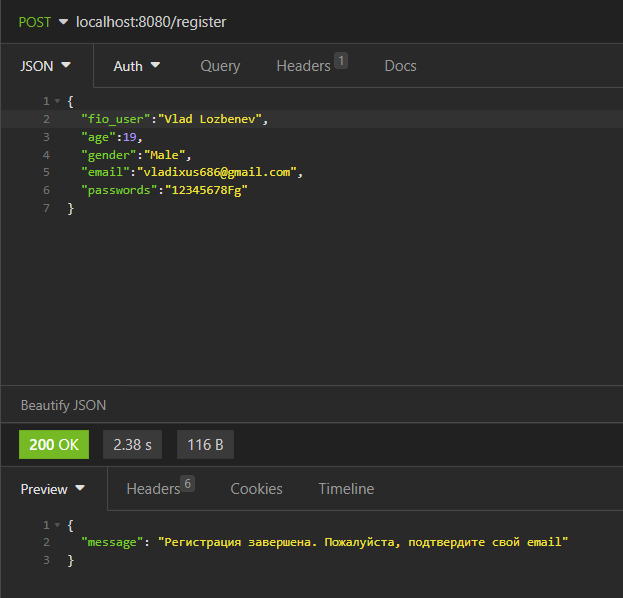
2. ## Confirm Email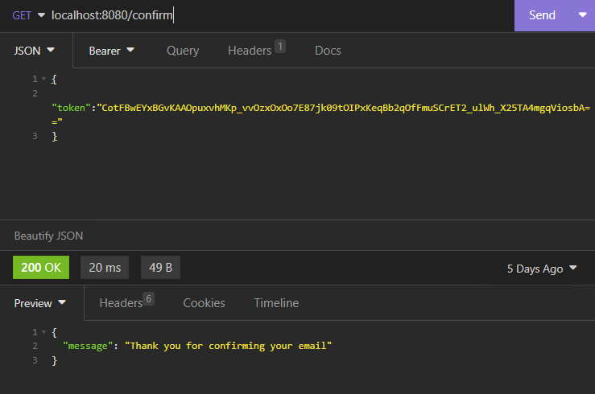
3. ## Login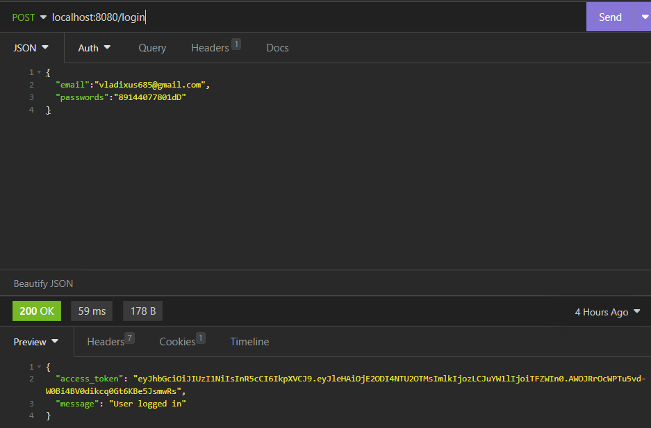
4. ## Reset Password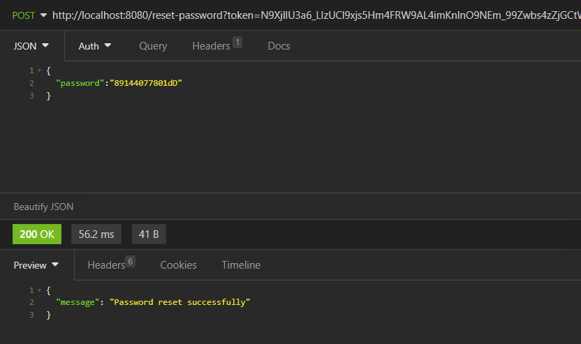
5. ## Update Profile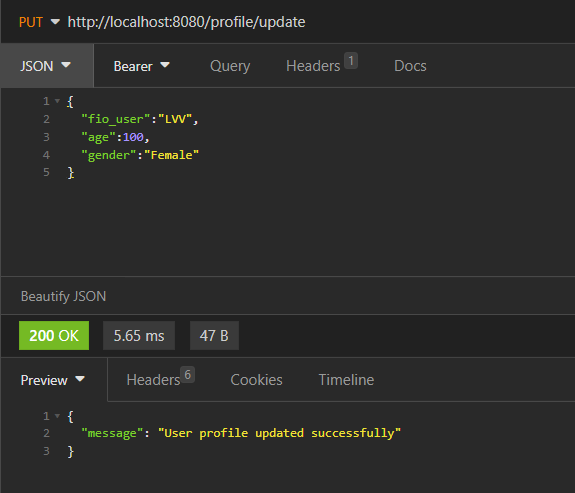
6. ## Post / Get Templates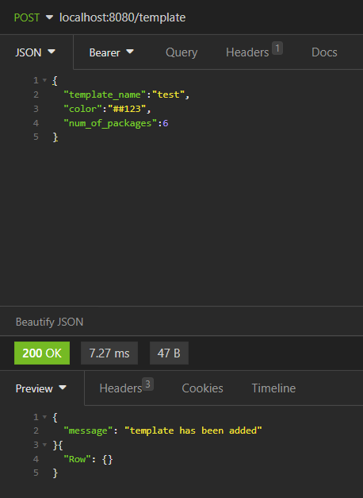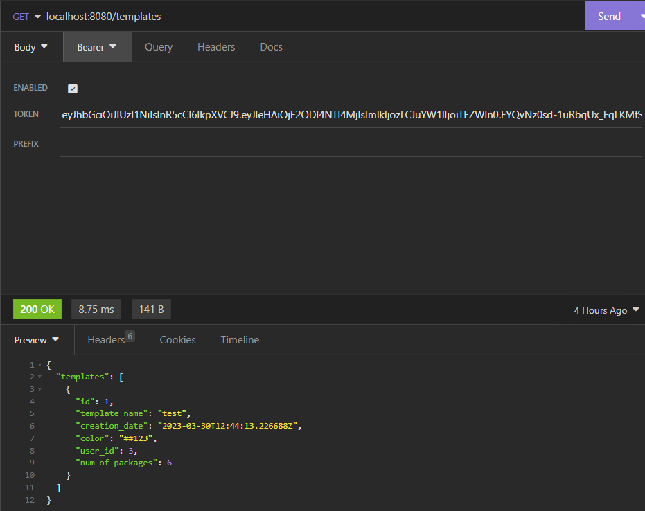
7. ## Post / Get Folders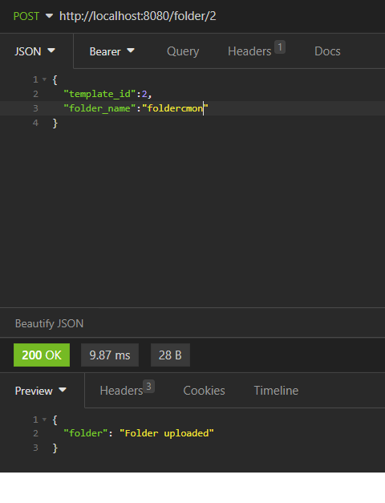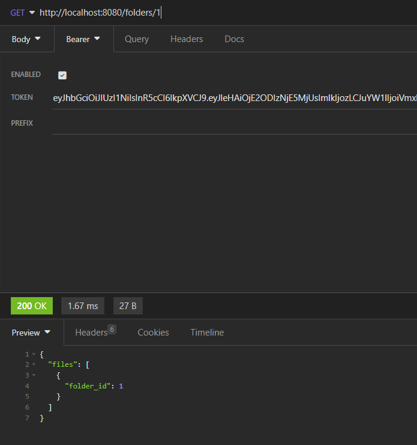
8. ## Get Library cards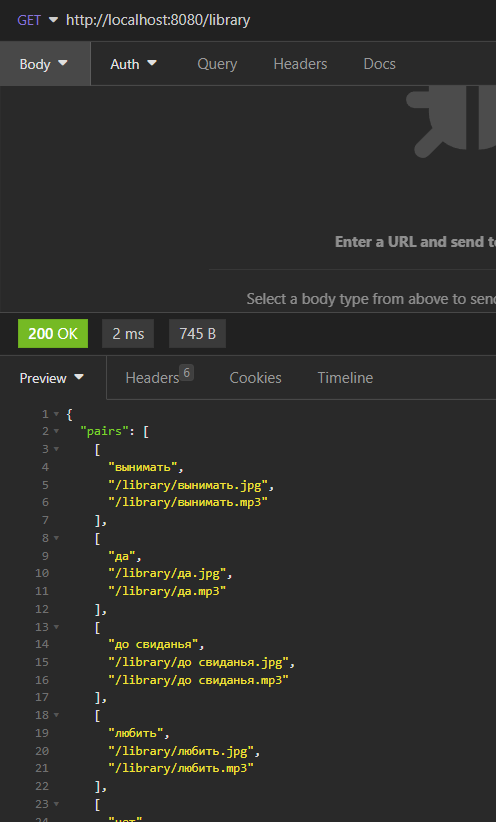
9. ## Adding cards to templates from Library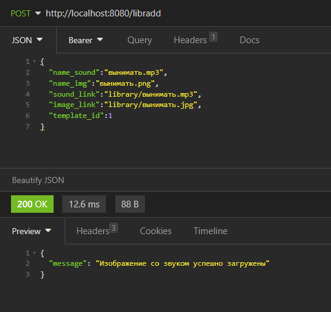
10. ## Upload own cards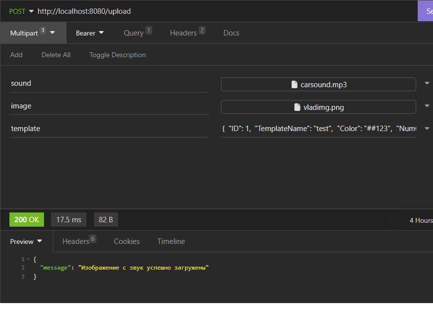
11.  ## Delete own cards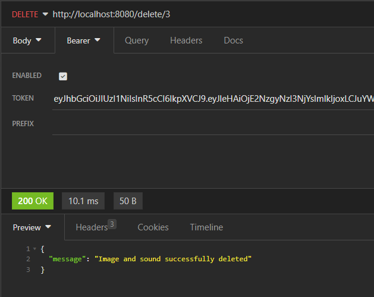
